# QuickPerf AI Auto-Fix — MCP Vision

> From detection to automated fix — how it works today, and how MCP evolves it.

---

## Part 1 — What We Built Today (Pipeline)

Our POC is a **pipeline** — Java code controls every step, the LLM just receives a prompt and returns text.

### Architecture


> **The LLM is passive.** It does NOT call tools, does NOT decide what to read. Your Java code gathers everything upfront and sends one big prompt.

---

## Part 2 — The MCP Evolution (Future)

With MCP, the LLM **takes control**. It decides what information to gather by calling tools.

### The 3 Actors

```mermaid
flowchart LR
    HOST["🖥️ MCP HOST<br/>(your Java app)<br/><br/>• Starts the process<br/>• Relays messages<br/>• Executes tool calls"]

    LLM["🧠 LLM<br/>(gptoss / GPT)<br/><br/>• Thinks<br/>• Decides which<br/>  tools to call<br/>• Generates the fix"]

    MCP["🔧 MCP SERVER<br/>(QuickPerf tools)<br/><br/>• get_alert·id·<br/>• find_entity·table·<br/>• read_file·path·<br/>• create_pr·files·"]

    HOST <-->|"API calls<br/>(prompt + tool results)"| LLM
    HOST <-->|"JSON-RPC<br/>(tool exec)"| MCP

    style HOST fill:#1a2744,stroke:#3b82f6,stroke-width:2px,color:#e2e8f0
    style LLM fill:#2d1535,stroke:#a855f7,stroke-width:2px,color:#e2e8f0
    style MCP fill:#0f2918,stroke:#22c55e,stroke-width:2px,color:#e2e8f0
```



> [!IMPORTANT]
> The LLM **never talks directly** to the MCP Server. The Host sits in the middle and relays everything.

### How a Tool Call Works

```mermaid
sequenceDiagram
    participant Host as 🖥️ HOST (your app)
    participant LLM as 🧠 LLM
    participant MCP as 🔧 MCP SERVER

    Note over Host: You start the process

    Host->>LLM: "Available tools: [get_alert, find_entity, read_file, create_pr]<br/>User says: Fix N+1 alert #42"

    LLM->>Host: I want to call: get_alert(42)

    Host->>MCP: Execute: get_alert(42)
    MCP->>Host: Result: {type: N_PLUS_ONE, tables: [address], ...}

    Host->>LLM: Tool result: {type: N_PLUS_ONE, tables: [address]}

    LLM->>Host: I want to call: find_entity("address")

    Host->>MCP: Execute: find_entity("address")
    MCP->>Host: Result: Address.java contents

    Host->>LLM: Tool result: Address.java with @ManyToOne User

    LLM->>Host: I want to call: read_file("User.java")

    Host->>MCP: Execute: read_file("User.java")
    MCP->>Host: Result: User.java contents

    Host->>LLM: Tool result: User.java with @OneToMany EAGER

    Note over LLM: LLM now has enough context.<br/>It generates the fix.

    LLM->>Host: FINAL ANSWER:<br/>Change EAGER→LAZY + add @EntityGraph

    Note over Host: Done! Host writes the fix files.
```



---

## Part 3 — A-to-Z Example with verification-app

### Step 0: The problem exists

```java
// User.java
@OneToMany(mappedBy = "user", fetch = FetchType.EAGER) // ← THE BUG
private List<Address> addresses;
```

A developer calls `GET /users` → 26 SQL queries fire instead of 1.

### Step 1: QuickPerf detects it

QuickPerf (embedded as servlet filter) counts queries and produces:

```json
{
  "type": "N_PLUS_ONE_DETECTED",
  "url": "/users",
  "method": "GET",
  "count": 26,
  "sample_query": "select a1_0.user_id, a1_0.id, a1_0.city from address a1_0 where a1_0.user_id=?",
  "impacted_tables": ["address"],
  "call_stack": [
    "com.example.testapp.controller.UserController.getUsers(UserController.java:49)",
    "com.example.testapp.service.UserService.getAllUsers(UserService.java:21)"
  ]
}
```

### Step 2: Alert saved to file

```bash
# Copy from logs → alert.json
```

### Step 3: AI tool runs (our POC pipeline)

```bash
java -jar ai-tool.jar alert.json /path/to/verification-app
```

**What happens inside:**

```
ContextBuilder reads alert.json
  → Parses call_stack → finds UserController.java
  → Parses impacted_tables ["address"] → finds Address.java
  → Scans Address.java → sees @ManyToOne User → finds User.java
  → Scans imports → finds UserRepository.java, AddressRepository.java

PromptBuilder assembles:
  System: "You are a JPA expert. Fix strategies: @EntityGraph, JOIN FETCH..."
  User: "Alert: 26 queries on /users \n Code: [5 files] \n Fix it."

LLM receives prompt → returns:
  "Analysis: FetchType.EAGER causes N+1
   Fix: EAGER→LAZY + @EntityGraph on UserRepository.findAll()
   [complete modified files + regression test]"

AiFixerService parses response → writes files to ./fix-output/
```

### Step 4: Review the fix

#### User.java — one line changed

```diff
-    @OneToMany(mappedBy = "user", fetch = FetchType.EAGER)
+    @OneToMany(mappedBy = "user", fetch = FetchType.LAZY)
     private List<Address> addresses;
```

#### UserRepository.java — one method added

```diff
 public interface UserRepository extends JpaRepository<User, Long> {
+
+    @EntityGraph(attributePaths = {"addresses"})
+    @Override
+    List<User> findAll();
 }
```

### Step 5: SQL result

| Before | After |
|--------|-------|
| 1× `SELECT * FROM users` | 1× `SELECT u.*, a.* FROM users u LEFT JOIN address a ON ...` |
| + 25× `SELECT * FROM address WHERE user_id=?` | — |
| **26 queries, ~250ms** | **1 query, ~10ms** |

---

## Part 4 — Regression Test with Hypersistence Utils

The LLM also generates a test that **permanently prevents** this N+1 from returning.

### Dependencies

```xml
<!-- SQL statement counting (by Vlad Mihalcea) -->
<dependency>
    <groupId>io.hypersistence</groupId>
    <artifactId>hypersistence-utils-hibernate-63</artifactId>
    <version>3.9.0</version>
    <scope>test</scope>
</dependency>

<!-- JDBC proxy to intercept queries -->
<dependency>
    <groupId>net.ttddyy</groupId>
    <artifactId>datasource-proxy</artifactId>
    <version>1.10</version>
    <scope>test</scope>
</dependency>
```

### The Test

```java
@SpringBootTest(webEnvironment = WebEnvironment.RANDOM_PORT)
class UserEndpointNPlusOneTest {

    @Autowired
    private TestRestTemplate restTemplate;

    @BeforeEach
    void resetCounter() {
        SQLStatementCountValidator.reset();
    }

    @Test
    void getUsers_shouldNotTriggerNPlusOne() {
        // Call the endpoint
        var response = restTemplate.getForEntity("/users", String.class);
        assertThat(response.getStatusCode().is2xxSuccessful()).isTrue();

        // Assert: exactly 1 SELECT, no N+1!
        SQLStatementCountValidator.assertSelectCount(1);
    }
}
```

### What happens in CI

```
✅ After fix:      1 SELECT  → assertSelectCount(1) PASSES
❌ If N+1 returns: 26 SELECTs → assertSelectCount(1) FAILS → BUILD BREAKS
```

> [!CAUTION]
> **Every fixed N+1 becomes a permanent guardrail.** If anyone changes the entity mapping back to EAGER, the test fails and the build breaks.

---

## Part 5 — Full Vision Pipeline

```mermaid
flowchart TB
    subgraph L1["🔍 LAYER 1 — Detection"]
        APP["Spring Boot App<br/>+ QuickPerf Filter"]
    end

    subgraph L2["📡 LAYER 2 — Alerting"]
        OS["OpenSearch<br/>JSON logs indexed"]
        SLACK["🔔 Slack / Email"]
    end

    subgraph L3["🤖 LAYER 3 — Auto-Fix"]
        direction TB
        HOST["MCP Host (ai-tool)"]
        LLM2["LLM (gptoss)"]
        TOOLS["MCP Server<br/>QuickPerf Tools"]
        HOST <--> LLM2
        HOST <--> TOOLS
    end

    subgraph L4["🛡️ LAYER 4 — Prevention"]
        PR["Pull Request<br/>fix + test"]
        CI["CI/CD<br/>assertSelectCount·1·"]
    end

    APP -->|"JSON alert"| OS
    OS -->|"alert trigger"| SLACK
    SLACK -->|"triggers"| HOST
    LLM2 -->|"generates"| PR
    PR --> CI

    style L1 fill:#1a2744,stroke:#3b82f6,stroke-width:2px,color:#e2e8f0
    style L2 fill:#2d1f0e,stroke:#f59e0b,stroke-width:2px,color:#e2e8f0
    style L3 fill:#2d1535,stroke:#a855f7,stroke-width:2px,color:#e2e8f0
    style L4 fill:#0f2918,stroke:#22c55e,stroke-width:2px,color:#e2e8f0
```



## Summary

| Step | Who | Does what |
|------|-----|-----------|
| **Detect** | QuickPerf (servlet filter) | Counts queries → produces JSON alert |
| **Alert** | OpenSearch → Slack | Notifies team |
| **Fix** | ai-tool → LLM | Reads alert + code → generates fix |
| **Test** | LLM | Generates Hypersistence Utils regression test |
| **Guard** | CI/CD | `assertSelectCount(1)` — blocks any N+1 regression |
