# QuickPerf AI Auto-Fix — MCP Vision

> How a single JSON alert becomes a code fix + regression test, automatically.

---

## 1. MCP Architecture — QuickPerf as Context Server

The key insight: **the LLM doesn't know your code**. It needs structured context. This is where the MCP (Model Context Protocol) vision comes in — QuickPerf acts as the **context provider**, feeding the AI everything it needs to produce accurate fixes.

```mermaid
flowchart LR
    subgraph Detection["Runtime Detection"]
        QP["QuickPerf<br/>Servlet Filter"]
    end

    subgraph MCP["MCP Layer — Context Protocol"]
        ALERT["📋 JSON Alert<br/>type · url · query · tables · call_stack"]
        CTX["🧠 Context Builder<br/>Discovers source files<br/>from alert metadata"]
        PROMPT["📝 Prompt Assembler<br/>Alert + Source Code<br/>→ Structured Request"]
    end

    subgraph AI["AI Agent"]
        LLM["🤖 LLM<br/>Analyzes entities<br/>Generates fix"]
    end

    subgraph Output["Deliverables"]
        FIX["✏️ Fixed Code"]
        TEST["🧪 Regression Test"]
    end

    QP -->|"Structured JSON"| ALERT
    ALERT --> CTX
    CTX -->|"5 files found"| PROMPT
    PROMPT -->|"System + User prompt"| LLM
    LLM --> FIX
    LLM --> TEST
```



### Why MCP Matters

| Without MCP | With MCP (QuickPerf) |
|-------------|----------------------|
| Dev manually pastes code into ChatGPT | **Automatic** — alert triggers the pipeline |
| LLM guesses which files matter | **Precise** — Context Builder finds exact files from `call_stack` + `impacted_tables` |
| No guarantee of fix quality | **Guided** — system prompt teaches fix patterns |
| Fix is lost after the chat | **Permanent** — regression test prevents recurrence |

---

## 2. Step-by-Step: From JSON to Fix

### Step 1 — QuickPerf Produces the Alert

When `GET /users` executes, QuickPerf detects 26 SELECTs (1 parent + 25 children):

```json
{
  "type": "N_PLUS_ONE_DETECTED",
  "url": "/users",
  "method": "GET",
  "operation_name": "getAllUsers",
  "count": 26,
  "sample_query": "select a1_0.user_id, a1_0.id, a1_0.city from address a1_0 where a1_0.user_id=?",
  "impacted_tables": ["address"],
  "call_stack": [
    "com.example.testapp.controller.UserController.getUsers(UserController.java:49)",
    "com.example.testapp.service.UserService.getAllUsers(UserService.java:21)",
    "org.springframework.data.jpa.repository.support.SimpleJpaRepository.findAll(SimpleJpaRepository.java:383)"
  ]
}
```

> [!NOTE]
> This JSON is machine-readable. It can be indexed in OpenSearch, trigger Slack alerts, **and** feed the AI tool — all from the same output.

### Step 2 — Context Builder Discovers Your Code

The tool takes the JSON + project root. **Zero configuration needed.**

```
📥 Input: alert.json + /path/to/verification-app

🔍 Parsing call_stack...
   "UserController.java:49"  → scanning project tree → ✅ Found
   "UserService.java:21"     → scanning project tree → (not present in demo)

🔍 Finding entities from impacted_tables: ["address"]
   Scanning all .java files for @Entity with @Table(name="address")
   → Address.java ✅

🔍 Scanning entity relationships...
   Address.java has @ManyToOne User → scanning for User.java
   → User.java ✅

🔍 Finding repositories from imports...
   UserController imports UserRepository → ✅
   UserController imports AddressRepository → ✅

📦 Result: 5 source files gathered
   1. UserController.java  (from call_stack)
   2. Address.java          (from impacted_tables)
   3. User.java             (from @ManyToOne relationship)
   4. UserRepository.java   (from imports)
   5. AddressRepository.java (from imports)
```

### Step 3 — Prompt Assembly

Two prompts are built:

**System prompt** — teaches the LLM how to be a JPA performance expert:
- What an N+1 is
- How to diagnose from alert metadata
- 4 fix strategies: `@EntityGraph`, `JOIN FETCH`, `@BatchSize`, `FetchType.LAZY`
- Response format with complete file contents

**User prompt** — pure data, no opinions:

```markdown
## N+1 Alert Details
- **Endpoint**: GET /users
- **Repeated query count**: 26
- **Sample query**: `select a1_0.user_id, a1_0.id, a1_0.city
                     from address a1_0 where a1_0.user_id=?`
- **Impacted tables**: [address]
- **Call stack**: [UserController → UserService → findAll]

## Source Code
### UserController.java
[complete file: shows findAll() + loop accessing getAddresses()]

### User.java
[complete file: shows @OneToMany(fetch = FetchType.EAGER)]

### Address.java
[complete file: shows @ManyToOne User]

### UserRepository.java
[complete file: extends JpaRepository]

### AddressRepository.java
[complete file: extends JpaRepository]

## Task
Fix the N+1 issue. Provide modified files and a regression test.
```

> [!IMPORTANT]
> The prompt contains **zero assumptions** about the fix. The LLM must analyze the entity relationship (`FetchType.EAGER` on `@OneToMany`) and decide the best strategy. The tool works on **any** project.

---

## 3. LLM Response — Concrete Fix for verification-app

### Analysis (by LLM)

> The root cause is in `User.java`:
> ```java
> @OneToMany(mappedBy = "user", fetch = FetchType.EAGER)
> private List<Address> addresses;
> ```
> `FetchType.EAGER` forces Hibernate to load all addresses immediately.
> Since `findAll()` is not aware of this, it fires **1 query per user** to load their addresses.
>
> **Impact**: 1 + 25 = 26 queries for what should be 1.

### Fix Strategy (by LLM)

> Two changes:
> 1. Change `FetchType.EAGER` → `FetchType.LAZY` on `User.addresses` (don't load unless needed)
> 2. Add `@EntityGraph(attributePaths = {"addresses"})` on `UserRepository.findAll()` to tell Hibernate to use a single JOIN query when we **do** need addresses

### Fixed Files

#### User.java — Before vs After

```diff
 @Entity
 @Table(name = "users")
 public class User {
     @Id @GeneratedValue(strategy = GenerationType.IDENTITY)
     private Long id;
     private String name;

-    @OneToMany(mappedBy = "user", fetch = FetchType.EAGER)
+    @OneToMany(mappedBy = "user", fetch = FetchType.LAZY)
     private List<Address> addresses;
 }
```

#### UserRepository.java — Before vs After

```diff
 public interface UserRepository extends JpaRepository<User, Long> {
+
+    @EntityGraph(attributePaths = {"addresses"})
+    @Override
+    List<User> findAll();
 }
```

### SQL Result

| Before (26 queries) | After (1 query) |
|---------------------|-----------------|
| `SELECT * FROM users` | `SELECT u.*, a.* FROM users u LEFT OUTER JOIN address a ON u.id = a.user_id` |
| 25× `SELECT * FROM address WHERE user_id=?` | — |

---

## 4. Regression Test — No-Regression with Hypersistence Utils

The LLM also generates an **integration test** that will permanently prevent this N+1 from returning. We use [Hypersistence Utils](https://github.com/vladmihalcea/hypersistence-utils) by Vlad Mihalcea — the standard library for asserting SQL query counts in Hibernate applications.

### Maven Dependencies

```xml
<!-- Hypersistence Utils — SQL statement counting -->
<dependency>
    <groupId>io.hypersistence</groupId>
    <artifactId>hypersistence-utils-hibernate-63</artifactId>
    <version>3.9.0</version>
    <scope>test</scope>
</dependency>

<!-- DataSource Proxy — intercepts SQL at JDBC level -->
<dependency>
    <groupId>net.ttddyy</groupId>
    <artifactId>datasource-proxy</artifactId>
    <version>1.10</version>
    <scope>test</scope>
</dependency>
```

### ProxyDataSource Configuration (Test)

```java
@TestConfiguration
public class DataSourceProxyConfig {

    @Bean
    public DataSource dataSource(DataSource originalDataSource) {
        return ProxyDataSourceBuilder.create(originalDataSource)
                .countQuery()
                .build();
    }
}
```

### The Integration Test

```java
package com.example.testapp;

import io.hypersistence.utils.jdbc.validator.SQLStatementCountValidator;
import org.junit.jupiter.api.BeforeEach;
import org.junit.jupiter.api.Test;
import org.springframework.beans.factory.annotation.Autowired;
import org.springframework.boot.test.context.SpringBootTest;
import org.springframework.boot.test.web.client.TestRestTemplate;
import org.springframework.boot.test.context.SpringBootTest.WebEnvironment;

import static org.assertj.core.api.Assertions.assertThat;

@SpringBootTest(webEnvironment = WebEnvironment.RANDOM_PORT)
class UserEndpointNPlusOneTest {

    @Autowired
    private TestRestTemplate restTemplate;

    @BeforeEach
    void resetCounter() {
        SQLStatementCountValidator.reset();
    }

    @Test
    void getUsers_shouldExecuteExactlyOneSelect() {
        // When — call the endpoint that was triggering N+1
        var response = restTemplate.getForEntity("/users", String.class);

        // Then — assert response is OK
        assertThat(response.getStatusCode().is2xxSuccessful()).isTrue();

        // Then — assert ONLY 1 SELECT was executed (no N+1!)
        SQLStatementCountValidator.assertSelectCount(1);

        // No inserts, updates, or deletes expected
        SQLStatementCountValidator.assertInsertCount(0);
        SQLStatementCountValidator.assertUpdateCount(0);
        SQLStatementCountValidator.assertDeleteCount(0);
    }
}
```

### What This Test Guarantees

```
✅ Passes after fix:   1 SELECT (JOIN FETCH)
❌ Fails if N+1 returns: "Expected 1 SELECT but got 26"
```

> [!CAUTION]
> This test will **break the build** if anyone reintroduces the N+1.
> That's exactly what we want — the fix becomes a permanent guardrail.

---

## 5. The Full Pipeline — Vision

```mermaid
sequenceDiagram
    participant App as 🟢 App + QuickPerf
    participant OS as 🔎 OpenSearch
    participant AI as 🤖 AI Agent (MCP)
    participant Git as 📦 Git / Bitbucket
    participant CI as ⚙️ CI/CD
    participant Dev as 👨‍💻 Developer

    Note over App: User hits GET /users

    App->>OS: JSON log: N_PLUS_ONE_DETECTED<br/>{count: 26, tables: [address]}

    OS->>AI: 🔔 Alert trigger

    AI->>AI: Context Builder<br/>→ discovers 5 source files

    AI->>AI: Prompt Builder<br/>→ alert + code → structured prompt

    AI->>AI: LLM call<br/>→ analysis + fix + test

    AI->>Git: 📝 Create PR<br/>• User.java (LAZY)<br/>• UserRepository.java (@EntityGraph)<br/>• UserEndpointNPlusOneTest.java

    Git->>Dev: PR notification

    Dev->>Dev: Review: 2 lines changed + 1 test

    Dev->>Git: ✅ Approve & merge

    Git->>CI: Build triggered

    CI->>CI: SQLStatementCountValidator<br/>assertSelectCount(1) ✅

    Note over CI: 🛡️ Future changes protected<br/>Any N+1 regression = build failure
```



---

## Summary

| Step | Component | Input | Output |
|------|-----------|-------|--------|
| **1. Detect** | QuickPerf (servlet filter) | HTTP request | JSON alert with `call_stack`, `impacted_tables`, `sample_query` |
| **2. Alert** | OpenSearch | JSON log | Slack/email notification |
| **3. Build Context** | AI Tool (Context Builder) | Alert JSON + project path | 5 discovered source files |
| **4. Generate Prompt** | AI Tool (Prompt Builder) | Alert + source code | System prompt + user prompt |
| **5. Fix** | LLM (via MCP) | Structured prompt | Fixed `User.java` + `UserRepository.java` |
| **6. Test** | LLM (via MCP) | Same prompt | `UserEndpointNPlusOneTest.java` with Hypersistence Utils |
| **7. Guard** | CI/CD | Test suite | `assertSelectCount(1)` — permanent protection |
