# QuickPerf: Intelligent Performance Guardian

> From Detection to Automated Prevention — Complete Walkthrough

---

## 1. The Problem

Every Spring Boot app using JPA/Hibernate is vulnerable to **N+1 queries** — a silent performance killer. A developer adds a simple `@OneToMany` mapping, and suddenly one API call generates **26 database queries** instead of 1.

**Today**: nobody catches this until production is slow. No alerts, no tests, no accountability.

**Our solution**: an automated pipeline that **detects → alerts → fixes → prevents**.

---

## 2. Architecture — 4 Layers of Protection

```mermaid
flowchart TB
    subgraph L1["🔍 LAYER 1 — DETECTION"]
        direction LR
        APP["🟢 Spring Boot App<br/>with QuickPerf Embedded"]
        NP1["⚠️ N+1 Queries"]
        SQ["🐢 Slow Queries"]
        HA["📊 Heap Allocation"]
        APP --> NP1
        APP --> SQ
        APP --> HA
    end

    subgraph L2["📡 LAYER 2 — OBSERVABILITY & ALERTING"]
        direction LR
        OS["🔎 OpenSearch<br/>Structured JSON Logs"]
        DASH["📈 Dashboards & KPIs"]
        ALERT["🔔 Alerting<br/>Slack · Email"]
        OS --> DASH
        OS --> ALERT
    end

    subgraph L3["🤖 LAYER 3 — AI-POWERED AUTO-FIX"]
        direction LR
        CTX["🧠 Context Builder"]
        AI["🤖 AI Agent"]
        PR["📝 Pull Request"]
        DEV["👨‍💻 Developer Review"]
        CTX --> AI
        AI --> PR
        PR --> DEV
    end

    subgraph L4["🛡️ LAYER 4 — REGRESSION PREVENTION"]
        direction LR
        TEST["✅ Integration Tests"]
        ASSERT["🎯 @ExpectSelect·1·"]
        SHIELD["🛡️ CI/CD Gate"]
        TEST --> ASSERT
        ASSERT --> SHIELD
    end

    L1 -->|"JSON Logs"| L2
    L2 -->|"Alert triggered"| L3
    L3 -->|"PR merged"| L4
    L4 -.->|"🔄 Continuous Protection"| L1

    style L1 fill:#1a2744,stroke:#3b82f6,stroke-width:2px,color:#e2e8f0
    style L2 fill:#2d1f0e,stroke:#f59e0b,stroke-width:2px,color:#e2e8f0
    style L3 fill:#2d1535,stroke:#a855f7,stroke-width:2px,color:#e2e8f0
    style L4 fill:#0f2918,stroke:#22c55e,stroke-width:2px,color:#e2e8f0
```



---

## 3. Demo App — The N+1 Scenario

A simple Spring Boot app with `User` → `Address` relationship:

````carousel
```java
// User.java — The parent entity
@Entity
@Table(name = "users")
public class User {
    @Id
    @GeneratedValue(strategy = GenerationType.IDENTITY)
    private Long id;
    private String name;

    @OneToMany(mappedBy = "user", fetch = FetchType.EAGER)  // ← THE PROBLEM
    private List<Address> addresses;
}
```
<!-- slide -->
```java
// Address.java — The child entity
@Entity
public class Address {
    @Id
    @GeneratedValue(strategy = GenerationType.IDENTITY)
    private Long id;
    private String city;

    @ManyToOne
    @JoinColumn(name = "user_id")
    private User user;
}
```
<!-- slide -->
```java
// UserController.java — Triggers the N+1
@GetMapping("/users")
public List<String> getUsers() {
    List<User> users = userRepository.findAll();   // 1 query
    List<String> names = new ArrayList<>();
    for (User user : users) {
        // Each iteration fires a query for addresses!
        names.add(user.getName() + " - "
                + user.getAddresses().size() + " addresses");
    }
    return names;   // Total: 1 + 25 = 26 queries 💀
}
```
````

**What happens when we call `GET /users`:**

| Query # | SQL | Why |
|---------|-----|-----|
| 1 | `SELECT * FROM users` | `findAll()` loads 25 users |
| 2–26 | `SELECT * FROM address WHERE user_id=?` | Each user's addresses loaded individually |

> **26 queries** for what should be **1 query** with a JOIN.

---

## 4. QuickPerf Detects It — JSON Alert

QuickPerf is embedded as a servlet filter. It intercepts every SQL query, analyzes patterns, and produces **structured JSON logs**:

```json
{
  "timestamp": 1770921772130,
  "type": "N_PLUS_ONE_DETECTED",
  "url": "/users",
  "method": "GET",
  "operation_name": "getAllUsers",
  "count": 26,
  "sample_query": "select a1_0.user_id, a1_0.id, a1_0.city from address a1_0 where a1_0.user_id=?",
  "impacted_tables": ["address"],
  "call_stack": [
    "com.example.testapp.controller.UserController.getUsers(UserController.java:49)",
    "com.example.testapp.service.UserService.getAllUsers(UserService.java:21)",
    "org.springframework.data.jpa.repository.support.SimpleJpaRepository.findAll(SimpleJpaRepository.java:383)"
  ]
}
```

> [!IMPORTANT]
> This JSON is the **input** to everything that follows — OpenSearch indexing, alerting, and AI auto-fix.

---

## 5. AI Context Builder — How It Discovers Your Code

The AI tool receives this JSON and **automatically finds all relevant source files** from your project:

```
📌 Input: alert.json + project source path
 
Step 1: Parse call_stack
  → "UserController.java:49" → search project → FOUND ✅
  → "UserService.java:21"    → search project → FOUND ✅
 
Step 2: Find entities from impacted_tables
  → table "address" → grep @Entity classes → Address.java FOUND ✅
 
Step 3: Scan entity relationships
  → Address has @ManyToOne User → User.java FOUND ✅
 
Step 4: Find repositories from imports
  → UserController imports UserRepository → FOUND ✅
  → UserController imports AddressRepository → FOUND ✅
 
📦 Result: 5 files gathered automatically
```

> [!TIP]
> The context builder requires **zero configuration**. It works on any project — just point it at the source root.

---

## 6. Generated Prompt — What the LLM Sees

The tool assembles a structured prompt from the alert + discovered source files:

### System Prompt (defines the LLM's expertise)

```
You are a senior Java/Spring Boot/JPA/Hibernate performance expert.
Your task is to fix N+1 SELECT query issues detected by QuickPerf.

## What is an N+1?
An N+1 occurs when:
1. A parent query loads N entities (SELECT * FROM users → 25 users)
2. For EACH entity, a separate query loads related data (25× SELECT * FROM address)

## Fix Strategies (in order of preference)
1. @EntityGraph — add to Repository interface
2. Custom @Query with JOIN FETCH
3. @BatchSize — for cartesian product risks
4. Change FetchType.EAGER to FetchType.LAZY

## Rules
- Provide COMPLETE file contents, never partial
- Generate a regression test using @ExpectSelect(N)
- Keep the fix minimal
```

### User Prompt (the actual data)

```markdown
## N+1 Alert Details
- **Endpoint**: GET /users
- **Repeated query count**: 26
- **Sample query**: `select a1_0.user_id, a1_0.id, a1_0.city
                     from address a1_0 where a1_0.user_id=?`
- **Impacted tables**: [address]
- **Call stack**:
  - `UserController.getUsers(UserController.java:49)`
  - `UserService.getAllUsers(UserService.java:21)`

## Source Code

### UserController.java
[full file contents...]

### Address.java
[full file contents...]

### User.java
[full file contents...]

### UserRepository.java
[full file contents...]

### AddressRepository.java
[full file contents...]

## Task
Fix the N+1 issue. Provide modified files and a regression test.
```

---

## 7. LLM Response — The Automated Fix

The AI analyzes the code and produces:

### Analysis

> The root cause is `@OneToMany(mappedBy = "user", fetch = FetchType.EAGER)` on `User.addresses`. When `findAll()` loads 25 users, Hibernate eagerly fetches each user's addresses in a **separate query** — producing 25 additional SELECTs.

### Fix Strategy

> **@EntityGraph on UserRepository** — the simplest and most maintainable approach. Override `findAll()` with an `@EntityGraph` annotation that tells Hibernate to load `addresses` in a single JOIN query. Also change `FetchType.EAGER` to `FetchType.LAZY` for safety.

### Modified Files

````carousel
```diff
 // User.java — Change EAGER → LAZY
 @Entity
 @Table(name = "users")
 public class User {
     @Id @GeneratedValue(strategy = GenerationType.IDENTITY)
     private Long id;
     private String name;

-    @OneToMany(mappedBy = "user", fetch = FetchType.EAGER)
+    @OneToMany(mappedBy = "user", fetch = FetchType.LAZY)
     private List<Address> addresses;
 }
```
<!-- slide -->
```diff
 // UserRepository.java — Add @EntityGraph
 public interface UserRepository extends JpaRepository<User, Long> {

+    @EntityGraph(attributePaths = {"addresses"})
+    @Override
+    List<User> findAll();
 }
```
<!-- slide -->
```java
// UserEndpointPerformanceTest.java — Regression test
@SpringBootTest(webEnvironment = RANDOM_PORT)
@AutoConfigureTestDatabase
class UserEndpointPerformanceTest {

    @Autowired
    private TestRestTemplate restTemplate;

    @Test
    @ExpectSelect(1)  // Only 1 SELECT — no more N+1!
    void getUsers_shouldNotTriggerNPlusOne() {
        restTemplate.getForEntity("/users", String.class);
    }
}
```
````

### Result

| Before | After |
|--------|-------|
| 26 queries | **1 query** |
| `SELECT * FROM users` + 25× `SELECT * FROM address` | `SELECT u.*, a.* FROM users u LEFT JOIN address a ON ...` |
| ~250ms | **~10ms** |

---

## 8. The Virtuous Cycle

```mermaid
sequenceDiagram
    participant Dev as 👨‍💻 Developer
    participant App as 🟢 App + QuickPerf
    participant OS as 🔎 OpenSearch
    participant AI as 🤖 AI Agent
    participant CI as ⚙️ CI/CD

    Note over Dev: Adds @OneToMany mapping

    Dev->>App: Deploy
    App->>OS: N+1 detected! (JSON log)
    OS->>AI: Alert triggered

    AI->>AI: Read source code<br/>Analyze entities<br/>Generate fix

    AI->>Dev: PR: @EntityGraph + test

    Dev->>Dev: Review & merge ✅

    Dev->>CI: CI runs test suite
    CI->>CI: @ExpectSelect(1) passes ✅

    Note over CI: Future JPA changes<br/>automatically caught 🛡️
```



> **Every N+1 found becomes a permanent regression test.**
> The system gets progressively more robust with each fix.

---

## What We Built

| Component | Description | Status |
|-----------|-------------|--------|
| **QuickPerf** | N+1 detection + structured JSON logging | ✅ Done |
| **verification-app** | Demo app with intentional N+1 | ✅ Done |
| **ai-tool** | Context builder + LLM prompt generator | ✅ Done |
| **OpenSearch** | Dashboards + alerting | 🔜 Next |
| **PR automation** | Bitbucket/GitHub PR creation | 🔜 Next |
