# QuickPerf: Intelligent Performance Guardian

> **From Detection to Automated Prevention**

---

## The Problem

Performance issues like **N+1 queries** silently degrade production systems. A single JPA mapping change can introduce new ones, and without robust regression testing, they go undetected until users complain.

---

## The Vision — 4 Layers of Automated Protection

```mermaid
flowchart TB
    subgraph L1["🔍 LAYER 1 — DETECTION"]
        direction LR
        APP["🟢 Spring Boot App<br/>with QuickPerf Embedded"]
        NP1["⚠️ N+1 Queries"]
        SQ["🐢 Slow Queries"]
        HA["📊 Heap Allocation"]
        APP --> NP1
        APP --> SQ
        APP --> HA
    end

    subgraph L2["📡 LAYER 2 — OBSERVABILITY & ALERTING"]
        direction LR
        OS["🔎 OpenSearch<br/>Structured JSON Logs"]
        DASH["📈 Dashboards & KPIs<br/>• N+1 count per endpoint<br/>• P95 query time<br/>• Heap trends"]
        ALERT["🔔 Alerting<br/>Slack · Email · PagerDuty"]
        OS --> DASH
        OS --> ALERT
    end

    subgraph L3["🤖 LAYER 3 — AI-POWERED AUTO-FIX"]
        direction LR
        CTX["🧠 AI Context Builder<br/>• OpenSearch KPIs<br/>• Code Repository Index<br/>• Stack Traces"]
        AI["🤖 AI Agent<br/>Analyze → Fix → PR"]
        PR["📝 Pull Request<br/>• EntityGraph fix<br/>• JOIN FETCH query<br/>• DTO projection"]
        DEV["👨‍💻 Developer<br/>Review & Approve"]
        CTX --> AI
        AI --> PR
        PR --> DEV
    end

    subgraph L4["🛡️ LAYER 4 — REGRESSION PREVENTION"]
        direction LR
        TEST["✅ Auto-Generated<br/>Integration Tests"]
        ASSERT["🎯 QuickPerf Assertions<br/>@ExpectSelect·1·<br/>@ExpectMaxQueryTime·200ms·"]
        SHIELD["🛡️ CI/CD Gate<br/>No Regression Passes"]
        TEST --> ASSERT
        ASSERT --> SHIELD
    end

    L1 -->|"Structured JSON Logs<br/>operation_name · trace_id · call_stack"| L2
    L2 -->|"Alert: N+1 detected on<br/>GET /api/users"| L3
    L3 -->|"PR merged → AI generates<br/>integration test"| L4
    L4 -.->|"🔄 Continuous Protection<br/>Future JPA changes caught"| L1

    style L1 fill:#1a2744,stroke:#3b82f6,stroke-width:2px,color:#e2e8f0
    style L2 fill:#2d1f0e,stroke:#f59e0b,stroke-width:2px,color:#e2e8f0
    style L3 fill:#2d1535,stroke:#a855f7,stroke-width:2px,color:#e2e8f0
    style L4 fill:#0f2918,stroke:#22c55e,stroke-width:2px,color:#e2e8f0
```



---

## Detailed Flow — A Real-World Scenario

```mermaid
sequenceDiagram
    participant Dev as 👨‍💻 Developer
    participant App as 🟢 Spring Boot + QuickPerf
    participant OS as 🔎 OpenSearch
    participant Alert as 🔔 Alert System
    participant AI as 🤖 AI Agent
    participant Git as 📁 Git Repository
    participant CI as ⚙️ CI/CD Pipeline

    Note over Dev: Adds @OneToMany mapping<br/>without JOIN FETCH

    Dev->>App: Deploy to production
    App->>App: QuickPerf detects N+1<br/>25 SELECTs on /api/users

    App->>OS: JSON log with full context<br/>operation_name, trace_id,<br/>call_stack, impacted_tables

    OS->>Alert: Threshold breached!<br/>N+1 count > 5

    Alert->>AI: Trigger AI analysis

    Note over AI: Builds rich context:<br/>1. Query patterns from OpenSearch<br/>2. Entity relationships from code<br/>3. Stack trace: Controller→Service→Repo

    AI->>Git: Creates PR with fix<br/>• Added @EntityGraph<br/>• JOIN FETCH query<br/>• DTO projection

    AI->>Git: Creates integration test<br/>@ExpectSelect(1)<br/>@ExpectMaxQueryTime(200)

    Git->>Dev: PR notification for review
    Dev->>Git: Approves & merges

    Git->>CI: Run test suite
    CI->>CI: QuickPerf tests pass ✅<br/>Only 1 SELECT executed

    Note over CI: Future JPA changes<br/>automatically caught<br/>by regression tests 🛡️
```



---

## What QuickPerf Captures Today

| Log Type | Fields | Example |
|---|---|---|
| **N+1 Detection** | `operation_name`, `trace_id`, `call_stack`, `impacted_tables`, `sample_query`, `count` | 25 address queries triggered by `UserController.getUsers` |
| **Slow Queries** | `operation_name`, `trace_id`, `sql`, `time_ms`, `caller` | Query took 1200ms on `/api/orders` |
| **JVM Metrics** | `operation_name`, `trace_id`, `heap_allocation_bytes`, `threshold_exceeded` | 50MB allocated on single request |

---

## AI-Generated Test Example

```java
@QuickPerfTest
@SpringBootTest(webEnvironment = RANDOM_PORT)
class UserEndpointPerformanceTest {

    @Test
    @ExpectSelect(1)  // Only 1 SELECT allowed — no N+1!
    @ExpectMaxQueryExecutionTime(200)  // Max 200ms per query
    void getUsers_shouldNotTriggerNPlusOne() {
        restTemplate.getForEntity("/api/users", String.class);
    }

    @Test
    @ExpectSelect(2)  // 1 for user + 1 for addresses (JOIN FETCH)
    void getUserWithAddresses_shouldUseJoinFetch() {
        restTemplate.getForEntity("/api/users/1", String.class);
    }
}
```

---

## The Virtuous Cycle

> **Detect → Alert → Fix → Test → Prevent → Detect...**

Every N+1 found in production becomes a **permanent regression test**, making the system progressively more robust. New JPA mappings are instantly caught by CI before reaching production.
